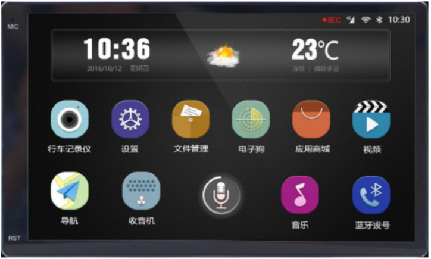

# 新能源车智慧车机系统设计

## 项目概述

新能源车智慧车机系统设计

参考图片

## 项目介绍

随着物联网技术的发展和新能源车市场的快速增长，智慧车机系统在提升驾驶体验、提高车辆安全性和实现智能管理方面具有巨大的潜力。智能车机市场近年来呈现出快速增长的趋势，预计2024年全球智能车机市场规模将达到500亿美元。本项目旨在开发一个基于物联网技术的新能源车智慧车机系统，以满足现代驾驶需求，并在未来市场中占据一席之地。

## 项目目标

开发一个集成多种功能的智慧车机系统，通过与车辆的深度集成，实现智能化管理和操作。系统将具备以下主要功能：

- 导航和娱乐功能
- 实时天气和时间显示
- 音乐播放器
- 流量充值服务
- 道路救援服务
- 座椅角度调节
- 语音控制（未完成）
- 倒车影像（未完成）

## 启动(Launch or Setup)

1. 下载`Qt Creator`并安装
2. 安装外部编译器`MSVC2019 64bit`，于`Qt Maintenance Tool`中安装Qt 6.6.3的`MSVC 2019 64-bit`编译器 与 `Qt Multimedia`多媒体库
3. 安装外部库`FFmpeg`
4. 官网下载[FFmpeg](https://ffmpeg.org/) 或 本篇已存储此库`ffmpeg-n7.0.1-win64-shared.zip`
5. 将库解压后将其中bin目录下的`.dll`代码添加至`Debug`目录下即可运行代码

## 功能详细描述

1. **系统启动**
   - 车辆启动后，车机系统自动开机并显示开机动画。
   - 开机动画符合项目主题，体现产品特点。

2. **主界面**
   - 使用QT框架实现所有GUI设计。
   - 主界面布局合理美观，用户可通过触摸屏与车机系统交互。
   - 主界面显示系统时间和天气信息，天气图标根据实时天气信息自动更新。

3. **语音控制**
   - 支持点击语音控制APP、原车语音按键和“你好小X”唤醒语音控制。
   - 智能语音模型训练后，系统能根据语音指令识别并执行命令，语音转换为文本并实时显示。

4. **音频播放器**
   - 支持基本的音乐播放功能：上/下一首、暂停/恢复、进度显示、音量调节。
   - 可读取指定路径下的音频文件，播放音频时背景动态显示。

5. **流量充值**
   - 用户可查看剩余流量并进行充值，通过扫码支付选择流量套餐。
   - 登录和充值通过云服务器实现。
   - 使用SQLite3实现服务器的数据存储格式

   数据库名称：Server.db

   表一：用户信息表

   | UserID（INTEGER)UNIQUE | Username(TEXT) | password(TEXT) | PHONE(TEXT) |
   | ---------------------- | -------------- | -------------- | ----------- |
   | 1                      |                |                |             |
   | 2                      |                |                |             |
   | 3                      |                |                |             |

   PASSWORD以加密方式MD5

6. **道路救援**
   - 提供一键道路救援服务，发送短信获取位置。

7. **倒车影像**
   - 支持倒车影像功能，实时显示摄像头获取的图像。

8. **座椅调节**
   - 实现座椅通风和加热功能，用户可调节风量等设置。（未完成）

9. **导航功能**
   - 从高德API获取地图数据，通过HTML显示。
   - 使用高德API实现。

## 项目实施

### 技术栈

- 使用C++和QT框架开发。
- 数据库采用SQLite3。
- 图形界面采用QT Widgets。
- 语音控制模型训练及实现。
- FFmpeg
- 高德地图 JS API

### 项目结构

- `main.cpp`：主程序入口，负责系统初始化和启动。
- `appbt.h`：按钮基类，负责按钮样式
- `backcar.h`：倒车影像模块，应时间不足，目前暂时空缺
- `Concretestates.h`：具体状态类，设置系统于不同状态下，运行不同行为
- `CustomDialog.h`：自定义对话框,实现座椅调节对话框
- `EmailSender.h`：邮箱类，实现救援发送邮件
- `httpweather.h`:天气信息类
- `musicplayer.h`：音乐播放器类
- `paid.h`:流量支付类
- `paidclient.h`:流量登录类
- `state.h`：状态类
- `videoplayer.h`：动画类
- `webmap.h`：地图导航类
- `mainwindow.h`：主界面类

### 开发环境

- **开发工具**：QT Creator
- **编译工具**：QT 6.6.3 MSVC2019 64bit
- **版本控制**：GitHub

### 开发步骤

1. **需求分析**：明确系统需求和功能。
2. **系统设计**：设计系统架构和模块划分。
3. **代码实现**：根据设计文档实现各模块功能。
4. **测试与调试**：进行单元测试、集成测试和系统测试。
5. **部署与维护**：将系统部署到目标环境，并进行后续维护。

### 项目交付

- 完整的项目源码
- 项目功能文档和README
- 项目演示视频
- 自动化编译的Makefile

## 联系(Contact)

上述不足之处，多多包涵，新人写GitHub

QQ邮箱：1789414411@qq.com

## 总结

本项目通过QT开发新能源车智慧车机系统，结合物联网技术，提升车辆智能化水平，满足现代用户需求，具有广阔的市场前景和应用价值。QT框架的强大功能和灵活性使得系统界面美观且操作流畅，提高了用户体验。
