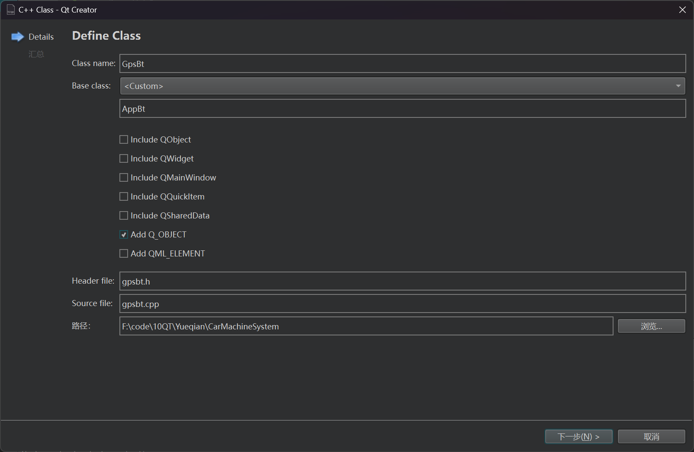
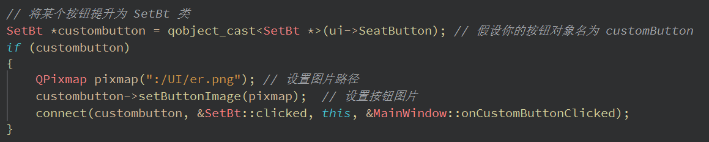

根据测试（设置按钮做调整）


```c++
/*!
* @file SetBt.h
* @brief 概述 设置按钮（测试）
* @author Bailan
* @version 版本号(maj.min，主版本.分版本格式)
* @date 日期: 2024 / 07 / 15
*/

#ifndef SETBT_H
#define SETBT_H

#include "appbt.h"

class SetBt : public AppBt
{
    Q_OBJECT

public:
    explicit SetBt(QWidget *parent = nullptr);

protected:
    void mousePressEvent(QMouseEvent *event) override;
    void mouseReleaseEvent(QMouseEvent *event) override;

signals:
    void pressed();
    void release();
};

#endif // SETBT_H

```


```c++
#include "setbt.h"
#include <QMouseEvent>
#include <QDebug>

SetBt::SetBt(QWidget *parent) : AppBt(parent)
{
    // 派生类初始化代码，如果有的话
}

// 鼠标按下事件
void SetBt::mousePressEvent(QMouseEvent *event)
{
    emit pressed();
    AppBt::mousePressEvent(event);
}

// 鼠标释放事件
void SetBt::mouseReleaseEvent(QMouseEvent *event)
{
    emit release();     // 释放信号
    emit clicked();     // 点击信号

    qDebug() << "设置按钮点击释放";

    AppBt::mouseReleaseEvent(event);
}

```

再将mainwidow.cpp 写上连接函数



编写槽函数

```c++
//测试按钮槽函数
void MainWindow::onCustomButtonClicked()
{
    // 自定义按钮点击处理
    qDebug()<<"槽函数-鼠标被点击(测试)";
}
```

最后在mainwodow.ui界面上将对应的按钮“提升为”

